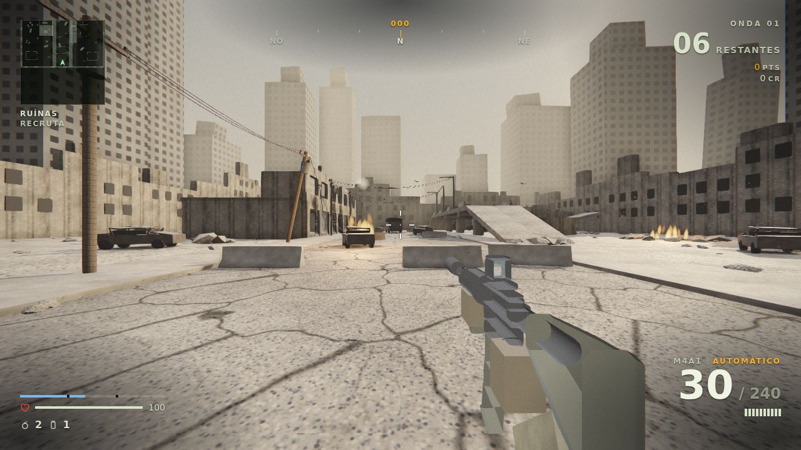
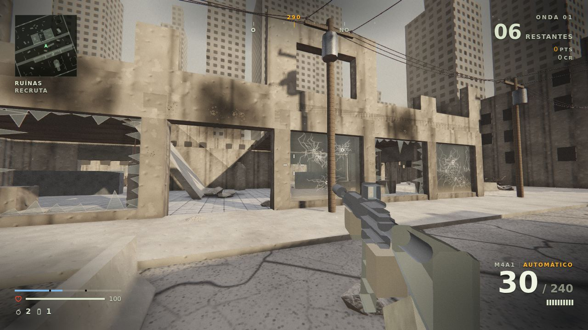
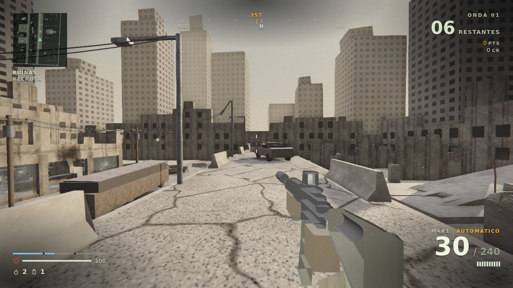

## Gráficos
Pausa → **Qualidade gráfica**:
- **Alta:** materiais PBR, oclusão de ambiente (SAO), bloom HDR, gradação ACES com vinheta e grão, SMAA.
- **Média:** bloom e gradação.
- **Baixa:** sem pós-processamento.

Texturas geradas por código (concreto, asfalto, terra, metal corrugado, madeira, tecido, ladrilho) em mapeamento
triplanar, com relevo e rugosidade variável; luz de ambiente (IBL) calculada a partir do céu de cada mapa.
Tudo vem do próprio Three.js (`examples/jsm`), sem baixar nada. Código em `fonte/src/game/graphics.ts`.

## Mapas
| Mapa | Clima | Destaque |
|---|---|---|
| **Ruínas** (novo, padrão) | cidade devastada, manhã enfumaçada (referência: Aftermath, BO2) | viaduto partido com rampas de laje, vitrine de vidro trincado que a bala atravessa, prédio desabado com ninho alto, drones abatíveis, fios soltando faísca |
| Ferro-Velho | pátio industrial, fim de tarde | corredor de contêineres, armazém central |
| Torre | deserto enevoado | mapa pequeno em volta da torre central |
| Saguão | terminal coberto | salão longo e salas laterais |

Lajes, pilares, entulho, barreiras e drones do Ruínas foram modelados no Trimble SketchUp (`ruinas-kit-sketchup.png`)
e exportados como malha para o jogo. Detalhes em `ART-DIRECTION.md` (seção 6 e 7b) e `level-ruinas.md`.

